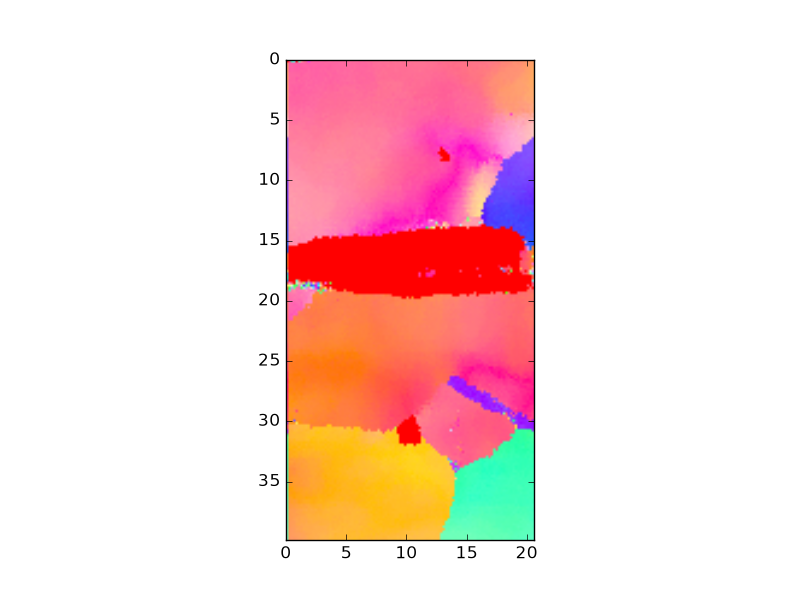
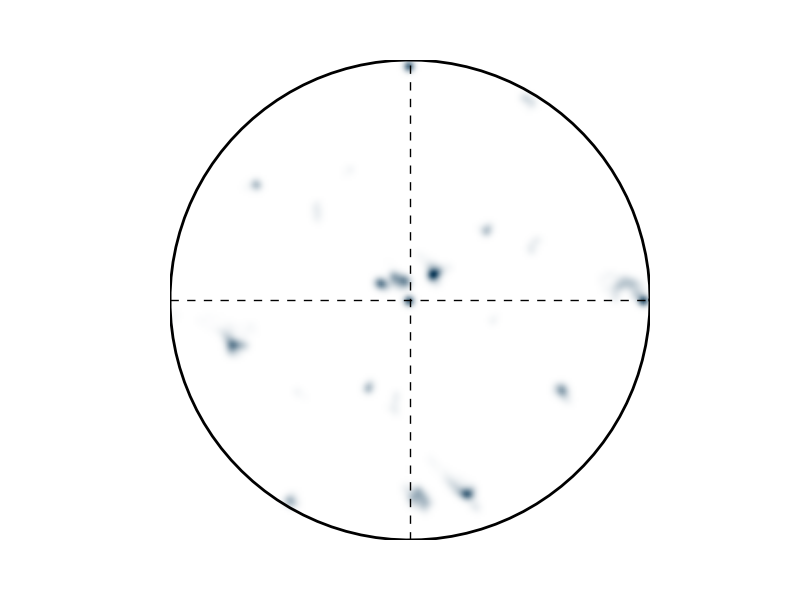

# ebsdlab

Electron Backscatter Diffraction (EBSD) is a microanalytical technique used in scanning electron microscopes to determine the crystallographic orientation at the micrometer scale. This software package provides tools to import, analyze, and visualize the data.

## Features:
  - File formats accepted .ang | .osc | .crc | .ctf | .txt
  - fast plotting: maps are drawn directly from the scan grid
    - virtual mask (only used for plotting)
      - increases speed in intermediate test plots
      - can be removed just before final plotting
  - verified with the OIM software and mTex
  - separate crystal orientation and plotting of it
  - some educational plotting
  - examples and documentation
  - minimal requirements on libraries


## Example
EBSD-Inverse Pole Figure (IPF) of polycrystalline Copper with corresponding Pole Figure
<table>
  <tr>
    <td></td>
    <td width="65%"></td>
  </tr>
</table>


## Installation
You can install `ebsdlab` (Python >=3.10) using Conda or pip.

<details>
<summary><strong>Using Conda</strong></summary>

  **Clone the repository:**

  ```console
  $ git clone https://github.com/micromechanics/ebsdlab.git ./ebsdlab
  $ cd ebsdlab
  ```

  **Create and activate the Conda environment:**

  The `environment.yml` file defines the necessary dependencies.
  ```console
  $ conda env create -f environment.yml
  ```
  After creation, activate the environment:
  ```console
  $ conda activate ebsdlab
  ```

  **Install the `ebsdlab` package:**
  With the Conda environment activated, install the package using pip:
  ```console
  $ python -m pip install .
  ```
</details>

<details>
<summary><strong>Using Pip</strong></summary>

  **Set up a Python environment:**
  Using a virtual environment prevents conflicts with other projects.
  ```console
  $ python -m venv venv_python_ebsd  # Create a virtual environment
  $ For Linux/macOS: source venv_python_ebsd/bin/activate
  $ For Windows: venv_python_ebsd\Scripts\activate
  ```

  **Install the `ebsdlab` package:**
  This command will install the package and dependencies:
  ```console
  $ pip install git+https://github.com/micromechanics/ebsdlab
  ```
</details>

After that, the package can be used as

```python
>>> from ebsdlab import EBSD
>>> emap = EBSD("tests/DataFiles/EBSD.ang")
>>> emap.plot(emap.ci)
```

### Graphical user interface

Install the optional GUI dependency and start the application:

```console
$ pip install 'ebsdlab[gui]'
$ ebsdlab-gui
```

## Documentation
[Documentation on github pages](https://micromechanics.github.io/ebsdlab/): quickstart, user guide,
conventions, verification against OIM and MTEX, design scope, and development (tests, static checks).

## FAQ
### Future features
  - improve cleaning
  - grain identification methods
  - speed up simulation
  - test non-cubic symmetries further: example data covers hexagonal, trigonal, orthorhombic, monoclinic and
    triclinic phases; only hexagonal has image tests

### Help wanted
 - sample files with tetragonal phases
 - feedback on tutorials
 - any feedback on functionality
 - help with cleaning and grain identification


## Issues
Open issues are tracked in [GitHub Issues](https://github.com/micromechanics/ebsdlab/issues). Local issue notes may
also be documented in this repository when they need to stay alongside the code.

## Notes
### Group: implement new features
- Grain reconstruction
- Loader for pymicro HDF5: Zenodo 12801865 (doi:10.5281/zenodo.12801865, CC-BY-4.0), CP-Ti grade 2 (hexagonal),
  `ET10_7_EBSD_post_mortem.h5` (10.4 MB; `ET10_7_EBSD_post_mortem_data_XYZ.h5`, 19.7 MB) with an OIM image of the
  same map, `ET10_7_EBSD_PM_clean_grains_OIM.tif` (0.9 MB), for comparison. The pymicro frame is unknown; it
  needs a row in `docs/source/conventions.rst`.
- Bruker `.ctf`: `docs/source/conventions.rst` has no Bruker row; every `.ctf` is treated as Oxford. Find a Bruker
  (Esprit) file with a figure made by Esprit; `W_TKD.ctf` cannot decide it alone, its paper plotted with MTEX.
- `plotPF` distribution: replace the pixel Gaussian on the stereographic image by a pole density function: von
  Mises-Fisher kernel (width in degrees) on the sphere, equal-area grid, normalized to mrd, then projected. Fixes
  rim/area distortion and gives comparable units; a step towards ODFs, which smooth in orientation space.

### Group: GUI
- Goal: extremely simple; only key parameters visible, everything else in the generated .py code.
- Flow: load once (info line) → process (min CI, crop to toolbar view, KAM on demand, cached) → plot; every change
  replots, no button. One 'Show' list: IPF (+direction), phase, IQ, CI, KAM, PF (+axis).
- One button at the end: render in full detail (omitting the automatic vmask).
- Defaults instead of options: scale bar on, axes off, unit-cell size from map (possibly 3 settings), automatic
  preview vmask for large maps. Formats from `fileIO.LOADERS` (adds `.ctf`).
- Generated code: ample comments, full map, ends with `plt.savefig(...)`.
