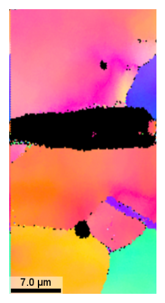
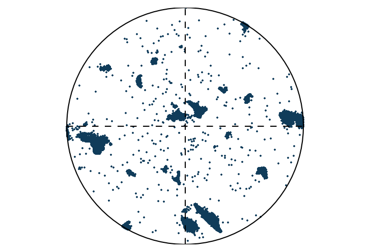

# ebsdlab

ALPHA-VERSION: TRY AT OWN RISK

Electron Backscatter Diffraction (EBSD) is a microanalytical technique used in scanning electron microscopes to determine the crystallographic orientation of metals at the micrometer scale. This software package provides tools to import, analyze, and visualize the spatially resolved orientation data obtained from EBSD experiments, facilitating microstructural characterization.

## Requirements
`ebsdlab` supports Python >=3.10.

## Features:
  - File formats accepted .ang | .osc | .crc | .txt
  - can write .ang for FCC. Others could be added
  - fast plotting interaction using virtual mask (only used for plotting)
    - increases speed in intermediate test plots
    - can be removed just before final plotting
  - verified with the OIM software and mTex
  - heavily tested for cubic
  - separate crystal orientation and plotting of it
  - some educational plotting
  - examples and lots of documentation

## Design scope
`ebsdlab` analyzes already indexed EBSD orientation data for known phases. It is
not intended to index raw Kikuchi patterns, identify phases from diffraction
patterns, or simulate EBSD patterns.

Accordingly, it models the rotational crystal symmetry required for orientation
analysis, not complete atomistic crystal structures. Atomic basis positions,
lattice centering, structure factors, and translational space-group operations
such as glide planes and screw axes are out of scope. These details become
necessary for phase identification, pattern simulation, or distinguishing
closely related crystal structures, but not for orientation maps, IPF colors,
misorientation, KAM, or pole-figure analysis of a known phase.

## Example
EBSD-Inverse Pole Figure (IPF) of polycrystalline Copper with corresponding Pole Figure
<table>
  <tr>
    <td></td>
    <td width="65%"></td>
  </tr>
</table>

## Documentation
[Documentation on github pages](https://micromechanics.github.io/ebsdlab/)

## Installation
You can install `ebsdlab` using Conda or pip.

<details>
<summary><strong>Using Conda</strong></summary>

  **Clone the repository:**

  ```console
  $ git clone https://github.com/micromechanics/ebsdlab.git ./ebsdlab
  $ cd ebsdlab
  ```

  **Create and activate the Conda environment:**

  The `environment.yml` file defines the necessary dependencies.
  ```console
  $ conda env create -f environment.yml
  ```
  After creation, activate the environment:
  ```console
  $ conda activate ebsdlab
  ```

  **Install the `ebsdlab` package:**
  With the Conda environment activated, install the package using pip:
  ```console
  $ python -m pip install .
  ```
</details>

<details>
<summary><strong>Using Pip</strong></summary>

  **Set up a Python environment:**
  Using a virtual environment prevents conflicts with other projects.
  ```console
  $ python -m venv venv_python_ebsd  # Create a virtual environment
  $ For Linux/macOS: source venv_python_ebsd/bin/activate
  $ For Windows: venv_python_ebsd\Scripts\activate
  ```

  **Install the `ebsdlab` package:**
  This command will install the package and dependencies:
  ```console
  $ pip install git+https://github.com/micromechanics/ebsdlab
  ```
</details>

After that, the package can be imported and used in Python codes as

```python
>>> from ebsdlab import EBSD
>>> emap = EBSD("tests/DataFiles/EBSD.ang")
>>> emap.plot(emap.ci)
```

### Graphical user interface

For a local desktop interface for common plots, install the optional GUI
dependency and start the application:

```console
$ pip install 'ebsdlab[gui]'
$ ebsdlab-gui
```

The GUI supports CI maps, IPF maps, and pole figures; it can apply CI/crop/
preview filters, place unit-cell overlays by clicking an IPF map, and copy the
equivalent Python code.

## Development
Use the local `.venv/` when it has been prepared for this repository, or create an environment with Python >=3.10 and install the development requirements.

```console
$ python -m pip install -r requirements-dev.txt
$ python -m pip install .
```

Run the test suite from the repository root:

```console
$ pytest --mpl --mpl-baseline-path=tests/baseline
```

Static checks are configured for:

```console
$ python -m mypy ebsdlab
$ python -m pylint ebsdlab
```

## Issues
Open issues are tracked in [GitHub Issues](https://github.com/micromechanics/ebsdlab/issues). Local issue notes may also be documented in this repository when they need to stay alongside the code.

- > One week of work remains
- Much polishing, incl GUI, Code
  - Make fast preview clearer
  - demo code incl. comments and savefig
- Simplify arguments, only Str as symmetric.py cubic
- Afterwards mypy
- Compare to orix, what is better/worse
- Yapf use for formatting with 110
- Neighbour and KAM calculations currently require scan rows ordered by x with
  a decreasing-x reset between rows. Single-row and differently ordered grids cannot be supported. -> Exception

## FAQ
### What features I do not envision:
  - include all crystal symmetries (materials science can mostly live with few)
  - other Euler angle definitions than Bunge; materials science does not use those

### Future features
  - improve cleaning
  - grain identification methods
  - speed up simulation
  - add different symmetries than cubic, and test

### Help wanted
 - sample files other than copper OIM files
 - feedback on tutorials
 - any feedback on functionality
 - help with cleaning and grain identification
