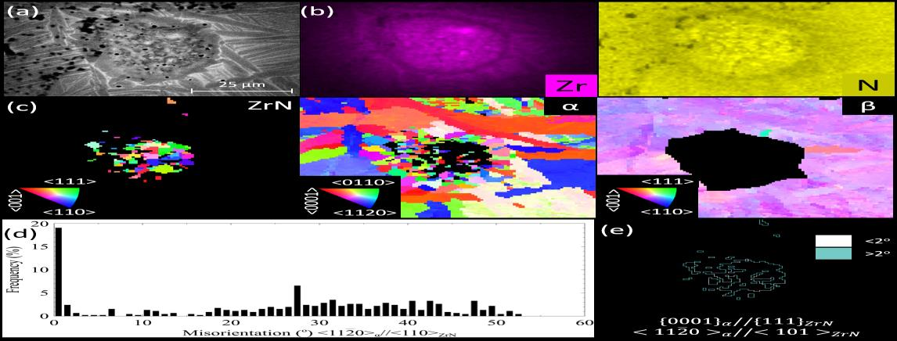

.. _comparison-gallery:

Comparison with published images
================================

This gallery puts the ebsdlab map of the example files next to the image published by the source of the data:
the paper that describes the dataset, or the MTEX documentation. The comparison is
loose: the images differ in plotted direction, color key, cropping and specimen frame (ebsdlab rotates every file
into X right, Y down, Z into the sample, see :ref:`conventions`; MTEX uses its own
frame), so look for the same grains and similar colors, not for identical pixels.

The source images of the ebsdlab example files are stored in ``docs/source/_static``; those of the MTEX examples
are downloaded once into ``tests/mtex_cache`` and are not part of ebsdlab. Their licenses are given below each
example.

.. jupyter-execute::

   import urllib.request
   import numpy as np
   import matplotlib
   import matplotlib.pyplot as plt
   from PIL import Image
   from ebsdlab.ebsd import EBSD

   def compare(ebsd, url, title, direction='ND', turns=0, mirror=False, scaleBar=None):
       """Plot the ebsdlab IPF map (left) next to the image of the data source (right).
       url: local file of the source image; turns: quarter turns of the ebsdlab map, counterclockwise
       mirror: mirror the ebsdlab map left-right after turning it
       scaleBar: length of the scale bar in µm, None for no scale bar
       """
       ebsd.plotIPF(direction, show=False)
       plt.close()
       figure, (left, right) = plt.subplots(1, 2, figsize=(16, 7))
       xLo, xHi, yHi, yLo = ebsd.imageExtent
       width, height = (yHi-yLo, xHi-xLo) if turns % 2 else (xHi-xLo, yHi-yLo)
       image = np.rot90(ebsd.image, turns)
       left.imshow(np.fliplr(image) if mirror else image, extent=(0, width, height, 0))
       if scaleBar is not None:
           ebsd.addScaleBarOverlay(left, scaleBar)
       left.set_title(f'ebsdlab: IPF {direction}' + (f', turned by {90*turns}°' if turns else '')
                      + (', mirrored' if mirror else ''))
       right.set_title(title)
       right.imshow(np.asarray(Image.open(url)))
       for axes in (left, right):
           axes.set_axis_off()
       figure.tight_layout()

Example files of ebsdlab
------------------------

The files are in ``tests/DataFiles``; ``tests/DataFiles/README.md`` lists their sources.

Magnesium alloy AZ31B, ``AZ31B.ang``
~~~~~~~~~~~~~~~~~~~~~~~~~~~~~~~~~~~~

The source image is Fig. 4f of M. Maj, S. Musiał, M. Nowak, "Plastic work partitioning during slip- and
twinning-dominated deformation in AZ31B magnesium alloy", Metall. Mater. Trans. A,
`doi:10.1007/s11661-026-08296-8 <https://doi.org/10.1007/s11661-026-08296-8>`_,
`arXiv:2512.19548 <https://arxiv.org/abs/2512.19548>`_, CC-BY-4.0: the ⊥ ED specimen after fracture, IPF along
TD, made with EDAX OIM. The image is cropped from the arXiv version and stored in ``docs/source/_static``.
``AZ31B.ang`` keeps every 6th row and column of the original map, and the paper shows the map turned by 90°.
OIM's TD is the file's y-axis, which ebsdlab puts along -X, so ebsdlab plots RD.

The map checks the hexagonal crystal frame of EDAX files: the colors match. If the crystals were turned by 30°
about c, the blue (10-10) and green (2-1-10) grains would swap colors.

.. jupyter-execute::

   compare(EBSD('../tests/DataFiles/AZ31B.ang'), 'source/_static/AZ31B_Maj2026_Fig4f.png', 'Maj et al., Fig. 4f',
           direction='RD', turns=1, scaleBar=100)

Calcite and aragonite shell, ``Catillopecten.crc``
~~~~~~~~~~~~~~~~~~~~~~~~~~~~~~~~~~~~~~~~~~~~~~~~~~

The source image is Supplementary Fig. S6b of A. G. Checa et al., Sci. Rep. 12 (2022) 11510,
`doi:10.1038/s41598-022-15796-1 <https://doi.org/10.1038/s41598-022-15796-1>`_, CC-BY-4.0: orientation map of the
outer shell surface (Site 24) on the image quality map, made with Oxford Channel 5. The map is cropped from the
supplementary information and stored in ``docs/source/_static``; its pole figures are left out. The two black
spikes and the yellow grain below the upper one are at the same places: the map is not mirrored.

.. jupyter-execute::

   compare(EBSD('../tests/DataFiles/Catillopecten.crc'), 'source/_static/Catillopecten_Checa2022_FigS6b.png',
           'Checa et al. 2022, Supplementary Fig. S6b', scaleBar=10)

Calcite aerial, ``Catillopecten_Fig6a.crc``
~~~~~~~~~~~~~~~~~~~~~~~~~~~~~~~~~~~~~~~~~~~

The map of Fig. 6a/b of the same paper (Site 8), cropped from the figure and stored in ``docs/source/_static``.
The paper colors along Z0 with its own key: 001 red, 120 green, 210 blue. The prism that Channel 5 draws in
Fig. 6b and the pole figures below the map check the frames of Oxford files: they match with the Euler angles as
stored and, for the {104} poles, the crystal turned by 30° about c. The paper's map is mirrored left-right;
probably the authors flipped it to compare it with the other panels of Fig. 6 (``Catillopecten.crc`` in Fig. S6b
is not mirrored).

.. jupyter-execute::

   compare(EBSD('../tests/DataFiles/Catillopecten_Fig6a.crc'), 'source/_static/Catillopecten_Checa2022_Fig6a.png',
           'Checa et al. 2022, Fig. 6a')

Eclogite grain map, ``Eclogite_Fig5.crc``
~~~~~~~~~~~~~~~~~~~~~~~~~~~~~~~~~~~~~~~~~

The source image is Fig. 5 of D. D. McNamara et al., J. Struct. Geol. (2023) 105033, `doi:10.1016/j.jsg.2023.105033
<https://doi.org/10.1016/j.jsg.2023.105033>`_, CC-BY-4.0, cropped from the figure and stored in
``docs/source/_static``: a phase map with misorientation boundaries, made with Oxford Channel 5 (omphacite green,
garnet red, clinozoisite yellow, hornblende blue, albite magenta, quartz cyan). ``Eclogite_Fig5.crc`` keeps every
4th row and column of the original map; the paper shows its upper 650 µm. ebsdlab plots the phases in the colors of
the paper, with the band contrast as gray for points that are not indexed; the paper's map is also cleaned (noise
reduction), the file is not. The garnets, the clinozoisite bands and the hornblende rims are at the same places: the
map is not mirrored.

.. jupyter-execute::

   eclogite = EBSD('../tests/DataFiles/Eclogite_Fig5.crc')
   # colors of Fig. 5 by phaseID: garnet, hornblende, albite, clinozoisite, omphacite, rutile, quartz, glaucophane
   colors = {1: 'red', 2: '#2040c0', 3: '#c040c0', 4: 'yellow', 5: '#108030', 7: '#60d0e0'}
   rgb = np.repeat(eclogite.bc[:, None]/eclogite.bc.max(), 3, axis=1)
   for phase, color in colors.items():
       rgb[eclogite.phaseID == phase] = matplotlib.colors.to_rgb(color)
   figure, (left, right) = plt.subplots(1, 2, figsize=(16, 7))
   left.imshow(rgb.reshape(eclogite.nRows, eclogite.nColsOdd, 3), extent=(0, eclogite.width, eclogite.height, 0))
   left.set_ylim(650, 0)
   eclogite.addScaleBarOverlay(left, 200)
   left.set_title('ebsdlab: phases')
   right.imshow(np.asarray(Image.open('source/_static/Eclogite_McNamara2023_Fig5.png')))
   right.set_title('McNamara et al. 2023, Fig. 5')
   for axes in (left, right):
       axes.set_axis_off()
   figure.tight_layout()

Titanium with ZrN, ``Ti_ZrN.ctf``
~~~~~~~~~~~~~~~~~~~~~~~~~~~~~~~~~

The map is Fig. 10c of J. Kennedy et al., Addit. Manuf. 40 (2021) 101928,
`doi:10.1016/j.addma.2021.101928 <https://doi.org/10.1016/j.addma.2021.101928>`_: IPF-ND maps of a ZrN particle
(centre) in α-Ti, made with Oxford AZtec, one map per phase. The figure below the ebsdlab maps is the whole Fig. 10,
unchanged, of the accepted manuscript (Cranfield University repository,
`hdl:1826/16408 <https://dspace.lib.cranfield.ac.uk/handle/1826/16408>`_), CC-BY-NC-ND-4.0, stored in
``docs/source/_static``.

The ZrN particle sits at the same place as in ebsdlab and the grains around it have the same shapes. In the paper,
ND is the build direction of the wall and the maps are ND-TD cross sections, so the paper's IPF ND colors along a
direction in the plane of the map: ebsdlab's X. ebsdlab therefore plots IPF RD, and the colors match for both
phases; ebsdlab's ND, the normal of the section, is the paper's welding direction. The paper's β-Ti map is
reconstructed from the α phase and has no counterpart in the file.

.. jupyter-execute::

   titanium = EBSD('../tests/DataFiles/Ti_ZrN.ctf')
   figure, axes = plt.subplots(1, 2, figsize=(14, 7))
   for axis, phase, name in zip(axes, (1, 3), ('α-Ti', 'ZrN')):
       titanium.mask = titanium.phaseID == phase
       titanium.plotIPF('RD', show=False)
       plt.close()
       axis.imshow(titanium.image)
       axis.set_title(f'ebsdlab: IPF RD, {name}')
       axis.set_axis_off()
   figure.tight_layout()

   Fig. 10 of J. Kennedy et al., accepted manuscript, CC-BY-NC-ND-4.0: (a) BSE image, (b) EDX Zr and N maps,
   (c) IPF ND maps of ZrN, α-Ti and reconstructed β-Ti, (d, e) misorientation between ZrN and α-Ti at their
   interface.

Tungsten, TKD, ``W_TKD.ctf``
~~~~~~~~~~~~~~~~~~~~~~~~~~~~

The source image is Fig. 1 of J. Wang et al., J. Mater. Res. 37 (2022) 3646,
`doi:10.1557/s43578-022-00733-9 <https://doi.org/10.1557/s43578-022-00733-9>`_, CC-BY-4.0: IPF maps of a
cross section through a wedge indent in single-crystal tungsten, measured with a Bruker e-FlashHD. The image is cropped
from the paper and stored in ``docs/source/_static``.

The maps match without any rotation: the paper plots RD to the right and TD down, like ebsdlab (see
:ref:`conventions`). The speckle in ebsdlab's maps are the 58 % of points that are not indexed; the paper
fills them.

.. jupyter-execute::

   import numpy as np
   import matplotlib
   import matplotlib.pyplot as plt
   from PIL import Image

   tungsten = EBSD('../tests/DataFiles/W_TKD.ctf')
   paper = np.asarray(Image.open('source/_static/W_Wang2022_Fig1.png'))
   width = paper.shape[1] // 3
   figure, axes = plt.subplots(2, 3, figsize=(16, 6.5))
   for i, direction in enumerate(('RD', 'TD', 'ND')):
       tungsten.plotIPF(direction, show=False)
       plt.close()
       image = tungsten.image
       columns = np.flatnonzero(image.any(axis=2).any(axis=0))
       rows = np.flatnonzero(image.any(axis=2).any(axis=1))
       axes[0, i].imshow(image[rows[0]:rows[-1]+1, columns[0]:columns[-1]+1])
       axes[0, i].set_title(f'ebsdlab: IPF {direction}')
       axes[1, i].imshow(paper[:, i*width:(i+1)*width])
       axes[1, i].set_title('Wang et al. 2022, Fig. 1' + 'abc'[i])
   for axis in axes.flat:
       axis.set_axis_off()
   figure.tight_layout()

Example files of MTEX
---------------------

MTEX ships example files, which are not copied into ebsdlab because MTEX is licensed GPL-2.0. Download them
from the MTEX repository, as ``tests/test_mtex.py`` does, into the cache ``tests/mtex_cache``, together with the
source images:

.. jupyter-execute::

   from pathlib import Path

   MTEX_DATA = ('https://raw.githubusercontent.com/mtex-toolbox/mtex/'
                'c836b404a6729ef339857e216ff4adda143d38fb/data/EBSD/')
   MTEX_FIGURES = 'https://mtex-toolbox.github.io/figures/'
   CACHE_DIR = Path('../tests/mtex_cache')

   def mtexFile(*names, url=MTEX_DATA):
       """Download MTEX example files or images into the cache, unless they are there already."""
       CACHE_DIR.mkdir(exist_ok=True)
       for name in names:
           if not (CACHE_DIR/name).exists():
               urllib.request.urlretrieve(url+name, CACHE_DIR/name)
       return str(CACHE_DIR/names[0])

The source images are from the `MTEX documentation <https://mtex-toolbox.github.io/>`_ (GPL-2.0). MTEX renumbers
them when its documentation is rebuilt; the cached copy keeps the image that was compared.

Iron, square grid, ``DC06_2uniax.ang``
~~~~~~~~~~~~~~~~~~~~~~~~~~~~~~~~~~~~~~

MTEX page `GND <https://mtex-toolbox.github.io/GND.html>`_: IPF along Y with grain boundaries. MTEX plots this map
with X up and Y to the left, Z out of the screen, as its axes symbol shows: seen from the other side than ebsdlab,
the ebsdlab map turned by 90° counterclockwise and then mirrored left-right. The sample frames are the same, so
MTEX's IPF Y has the colors of ebsdlab's TD.

.. jupyter-execute::

   compare(EBSD(mtexFile('DC06_2uniax.ang')), mtexFile('GND_01.png', url=MTEX_FIGURES), 'MTEX: IPF Y',
           direction='TD', turns=1, mirror=True)

Copper, ``copper.osc``
~~~~~~~~~~~~~~~~~~~~~~

MTEX page `EBSD2ODF <https://mtex-toolbox.github.io/EBSD2ODF.html>`_: IPF map along Z. The MTEX map is the ebsdlab
map flipped vertically (turned by 180° and mirrored), with the same colors, as for ``twins.ctf``: a 180° turn about
x flips the map, and Z and -Z have the same color for cubic crystals. MTEX has several plotting conventions (which
axes point right and up); probably one of them causes the flip.

.. jupyter-execute::

   compare(EBSD(mtexFile('copper.osc'), symmetry='cubic'), mtexFile('EBSD2ODF_01.png', url=MTEX_FIGURES),
           'MTEX: IPF', turns=2, mirror=True)

Olivine and other minerals, ``olivineopticalmap.ang``
~~~~~~~~~~~~~~~~~~~~~~~~~~~~~~~~~~~~~~~~~~~~~~~~~~~~~

MTEX page `EBSDReferenceFrame <https://mtex-toolbox.github.io/EBSDReferenceFrame.html>`_: olivine IPF along Z.

.. jupyter-execute::

   compare(EBSD(mtexFile('olivineopticalmap.ang')), mtexFile('EBSDReferenceFrame_01.png', url=MTEX_FIGURES),
           'MTEX: IPF Z')

Titanium alpha and beta, ``EDXLMDTi64.crc``
~~~~~~~~~~~~~~~~~~~~~~~~~~~~~~~~~~~~~~~~~~~

MTEX page `TiBetaReconstruction <https://mtex-toolbox.github.io/TiBetaReconstruction.html>`_: alpha-Ti IPF map.

.. jupyter-execute::

   compare(EBSD(mtexFile('EDXLMDTi64.crc', 'EDXLMDTi64.cpr')),
           mtexFile('TiBetaReconstruction_01.png', url=MTEX_FIGURES),
           'MTEX: IPF')

Magnesium twins, ``twins.ctf``
~~~~~~~~~~~~~~~~~~~~~~~~~~~~~~

MTEX page `EBSDGrid <https://mtex-toolbox.github.io/EBSDGrid.html>`_: orientation map; MTEX rotates the Euler angles
by 180° about x when loading. The MTEX map is the ebsdlab map flipped vertically (turned by 180° and mirrored), with
the same colors: a 180° turn about x turns Y and Z around, which flips the map, and Z and -Z have the same color in
the hexagonal Laue group.

.. jupyter-execute::

   compare(EBSD(mtexFile('twins.ctf')), mtexFile('EBSDGrid_01.png', url=MTEX_FIGURES), 'MTEX: orientation map',
           turns=2, mirror=True)
