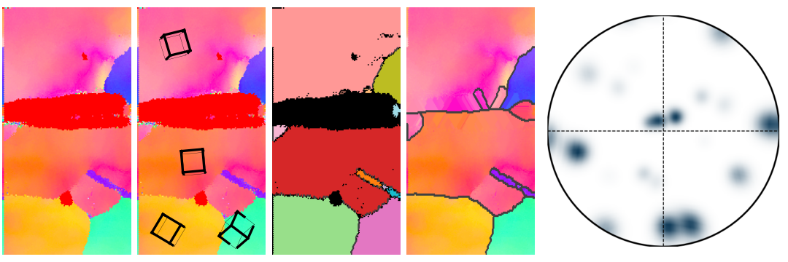

ebsdlab
=======

ebsdlab reads, plots and analyzes already indexed EBSD orientation maps.

Features
--------

- reads .ang | .osc | .h5 (EDAX) | .crc | .ctf | .txt; writes .ang
- fast plotting: maps are drawn directly from the scan grid; a virtual mask, used only for plotting, gives quick
  previews and crops
- verified with the OIM software and mTex (:ref:`verification`); heavily tested for cubic
- one sample frame for all vendors (:ref:`conventions`)
- separate crystal orientation and plotting of it; some educational plotting
- graphical user interface ``ebsdlab-gui``
- minimal requirements on libraries

.. toctree::
   :maxdepth: 1
   :caption: Getting started

   installation
   quickstart
   ebsd

.. toctree::
   :maxdepth: 1
   :caption: Background

   conventions
   orientation
   symmetry
   scope

.. toctree::
   :maxdepth: 1
   :caption: Validation

   verification
   comparison
   comparisonOrix

.. toctree::
   :maxdepth: 1
   :caption: Reference

   api
   development
