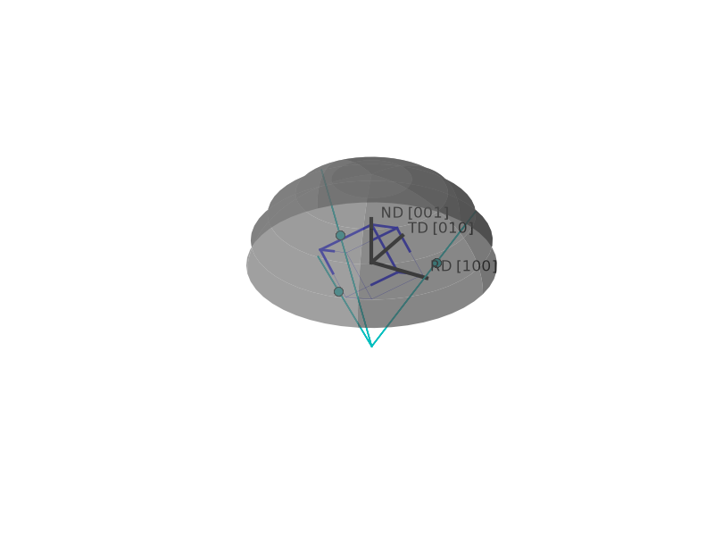

.. default-domain:: py

Tutorial on Rotations
=====================

The ``Orientation`` class combines a material symmetry (e.g. cubic) with a rotation.

Example: Specific orientations
------------------------------

This example investigates three specific orientations, the Euler angles that define them and their corresponding Inverse Pole Figure (IPF) colors for the [001] axis of the crystal. Answers are given in RGB scale:

- [100] = red   (R=1,B=0,G=0) (no rotation)
- [110] = green (R=0,B=1,G=0) (from [100] with rotation by 45 degrees around Phi)
- [111] = blue  (R=0,B=0,G=1) (from [100] with rotation of 55 and 45 degrees respectively)

Each example:

    1. creates an euler-angle-triple in radians by using 3 degree values,
    2. creates an Orientation object (print it in one case)
    3. rounds the color for improved readability

.. jupyter-execute::

    import numpy as np
    from ebsdlab.orientation import Orientation

    angle = np.radians([0,0,0])
    o = Orientation(eulers=angle, symmetry="cubic")
    print('Orientation object is easy to read:', o)
    np.round(o.ipfColor([0,0,1]),3)

    angle = np.radians([0,45,0])
    o = Orientation(eulers=angle, symmetry="cubic")
    np.round(o.ipfColor([0,0,1]),3)

    angle = np.radians([0,55,45])
    o = Orientation(eulers=angle, symmetry="cubic")
    np.round(o.ipfColor([0,0,1]),3)

Plot unit cell
--------------

Plot unit cells and pole-figures using the orientation-class. The 2D view follows the :ref:`conventions`, like
maps and pole figures: RD right, TD down, seen from above the sample.

    - first item is one looking for
    - plot 2D projection of the unit cell
    - plot also the poles and add scaling

.. jupyter-execute::

   import numpy as np
   from ebsdlab.orientation import Orientation
   angle = np.radians([0,55,45])
   o = Orientation(eulers=angle, symmetry="cubic")
   o.toScreen()
   o.plot()
   o.plot(poles=[1,0,0], scale=1.5)

Example: [111] direction using vectors
--------------------------------------

The [111] direction can be challenging to define ad-hoc using Euler angles. This example demonstrates how to calculate and verify it using vectors. At the end, we plot the crystal and the poles of the [100] in the standard stereographic projection.

Procedure:

    1. we know the normal direction hkl = 111
    2. we pick an arbitrary direction (1,-1,0) and verify that it is perpendicular
    3. we normalize the vectors and calculate the third by the cross-product
    4. we create the rotation matrix by stacking the vectors next to eachother
    5. we verify it by plotting and obtain the Euler angles

.. jupyter-execute::

    import numpy as np
    from ebsdlab.orientation import Orientation
    hkl = np.array([1,1,1],   dtype=float)
    uvw1 = np.array([1,-1,0], dtype=float)
    print('Verify: dot product of hkl and uvw1 should be 0:', np.dot(hkl,uvw1))

    # normalize vectors and calculate uvw2
    hkl /= np.linalg.norm(hkl)
    uvw1 /= np.linalg.norm(uvw1)
    uvw2 = np.cross(hkl,uvw1)

    # create rotation matrix by stacking vectors
    rotM = np.vstack( (uvw1,uvw2,hkl) )
    print('Rotation matrix is: \n',rotM)

    # plot it and calculate Euler angles
    o = Orientation(matrix=rotM, symmetry='cubic')
    print('Euler angles are in degree: ',o.asEulers(degrees=True))
    print('The color is: ',np.round(o.ipfColor( [0,0,1] ),3))
    o.plot()
    o.plot([1,0,0])

Example: Compare to OIM Software
--------------------------------

OIM software shows the 2D projection with the Rolling Direction (RD) upward and the Normal Direction (ND) out of
the plane: ``plot2D='up-left'``. Many textbooks have RD downward: ``plot2D='down-right'``. ebsdlab's own view,
``plot2D='right-down'`` (default), is described on the :ref:`conventions` page.

.. jupyter-execute::

   import numpy as np
   from ebsdlab.orientation import Orientation
   o = Orientation(eulers=np.radians([0,10,10]), symmetry="cubic")
   o.plot()
   o.plot(plot2D='up-left')
   o.plot(poles=[1,0,0], plot2D='up-left', scale=1.5)
   o.plot(poles=[1,1,1], plot2D='right-down')
   o.toScreen(equivalent=False)

Which outputs HKL and UVW as integers:
    - Euler angles: [ 0. 10. 10.]
    - HKL [ 1  5 32]
    - UVW [ 5 -1  0]

The HKL and UVW vectors are rounded to integers, hence they are approximate values. They are convenient for quick inspection but not precise.
